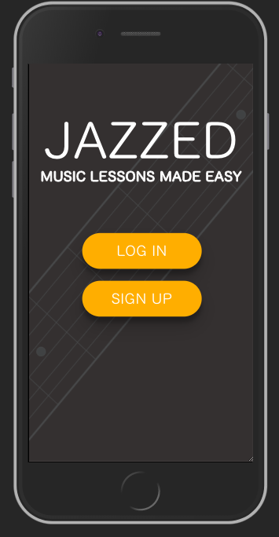

# Music Lessons

[Jazzed](https://jazzed.herokuapp.com/) is a web application for scheduling music lessons with local musicians. Users can instructors, view available time slots, and book lessons.

## Getting Started

**Install Postgresql

1. Clone the repository and run `npm install`
```shell
createdb music_lessons_dev
createdb music_lessons_test
knex migrate:latest
knex seed:run
```
2. Create the JWT_KEY

```shell
bash -c 'echo "JWT_KEY="$(openssl rand -base64 64)' > .env
```
3. Run tests using `npm test`

## Navigating the Site




## Project Planning

Task Management: https://trello.com/b/qFSJYITo/music-lessons-portal

Wireframes: https://xd.adobe.com/view/53e24b1a-cddb-4d2e-8578-5ea2c928b772/

## Style Guide

- Materialize
- Font - YuKyokasho
- Pod Colors - #FAAD00 - yellow
- Background - #333030 - dark grey
- Font color - white / black
- Logo border & background graphic - #95989A

## JWT_KEY
```shell
bash -c 'echo "JWT_KEY="$(openssl rand -base64 64)' > .env
```

## Routes

- GET users/
- GET users/id
- GET users/id/lessons
- POST users/
- PATCH users/id
- DELETE users/id

- GET lessons/
- GET lessons/id
- POST lessons/
- PATCH lessons/id
- DELETE lessons/id

- GET skill_level/
- GET skill_level/id
- POST skill_level/
- PATCH skill_level/id
- DELETE skill_level/id

- GET /token
- POST /token
- DELETE /token

## Team Members

* [Nigel Flippo](https://github.com/nigelflippo)
* [Eddie Marovich](https://github.com/eddiemarovich)
* [Frederick Engelhardt](https://github.com/FrederickEngelhardt)
